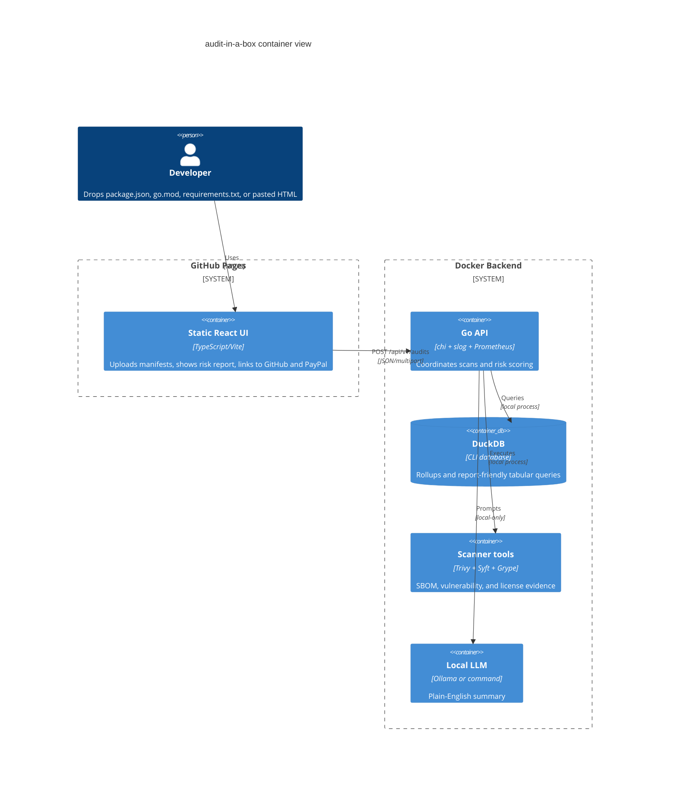

# audit-in-a-box

Live site: https://baditaflorin.github.io/audit-in-a-box/

Repository: https://github.com/baditaflorin/audit-in-a-box

Support: https://www.paypal.com/paypalme/florinbadita

Static web UI plus local Docker analyzer for OSS dependency risk reports.

## Quickstart

```bash
make install-hooks
make dev
make build
make test
make smoke
```

The GitHub Pages frontend is the public entrypoint. The analyzer runs as a local or hosted Docker backend so Trivy, Syft, Grype, DuckDB, and a local LLM can process user-provided manifests without putting secrets in the browser.

## Architecture



## Documentation

- Architecture: docs/architecture.md
- API: docs/api.md
- Deployment: deploy/README.md
- ADRs: docs/adr/
- Postmortem: docs/postmortem.md

## License

MIT
