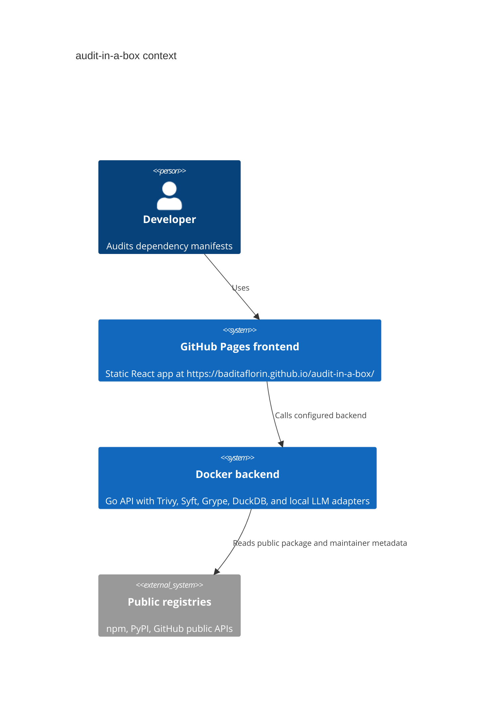
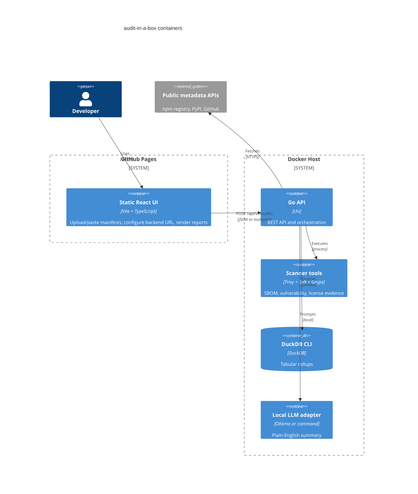

# Architecture

## Context

```mermaid
C4Context
title audit-in-a-box context
Person(dev, "Developer", "Audits dependency manifests")
System(site, "GitHub Pages frontend", "Static React app at https://baditaflorin.github.io/audit-in-a-box/")
System(api, "Docker backend", "Go API with Trivy, Syft, Grype, DuckDB, and local LLM adapters")
System_Ext(registry, "Public registries", "npm, PyPI, GitHub public APIs")
Rel(dev, site, "Uses")
Rel(site, api, "Calls configured backend")
Rel(api, registry, "Reads public package and maintainer metadata")
```

## Container View

```mermaid
C4Container
title audit-in-a-box containers
Person(user, "Developer")
System_Boundary(pages, "GitHub Pages") {
  Container(frontend, "Static React UI", "Vite + TypeScript", "Upload/paste manifests, configure backend URL, render reports")
}
System_Boundary(server, "Docker Host") {
  Container(api, "Go API", "chi", "REST API and orchestration")
  Container(scanner, "Scanner tools", "Trivy + Syft + Grype", "SBOM, vulnerability, license evidence")
  ContainerDb(duckdb, "DuckDB CLI", "DuckDB", "Tabular rollups")
  Container(llm, "Local LLM adapter", "Ollama or command", "Plain-English summary")
}
System_Ext(meta, "Public metadata APIs", "npm registry, PyPI, GitHub")
Rel(user, frontend, "Uses", "HTTPS")
Rel(frontend, api, "POST /api/v1/audits", "JSON or multipart")
Rel(api, scanner, "Executes", "process")
Rel(api, duckdb, "Queries", "process")
Rel(api, llm, "Prompts", "local")
Rel(api, meta, "Fetches", "HTTPS")
```

The GitHub Pages boundary is explicit: Pages only serves static files and never stores secrets. All runtime scanning happens in the Docker backend.
